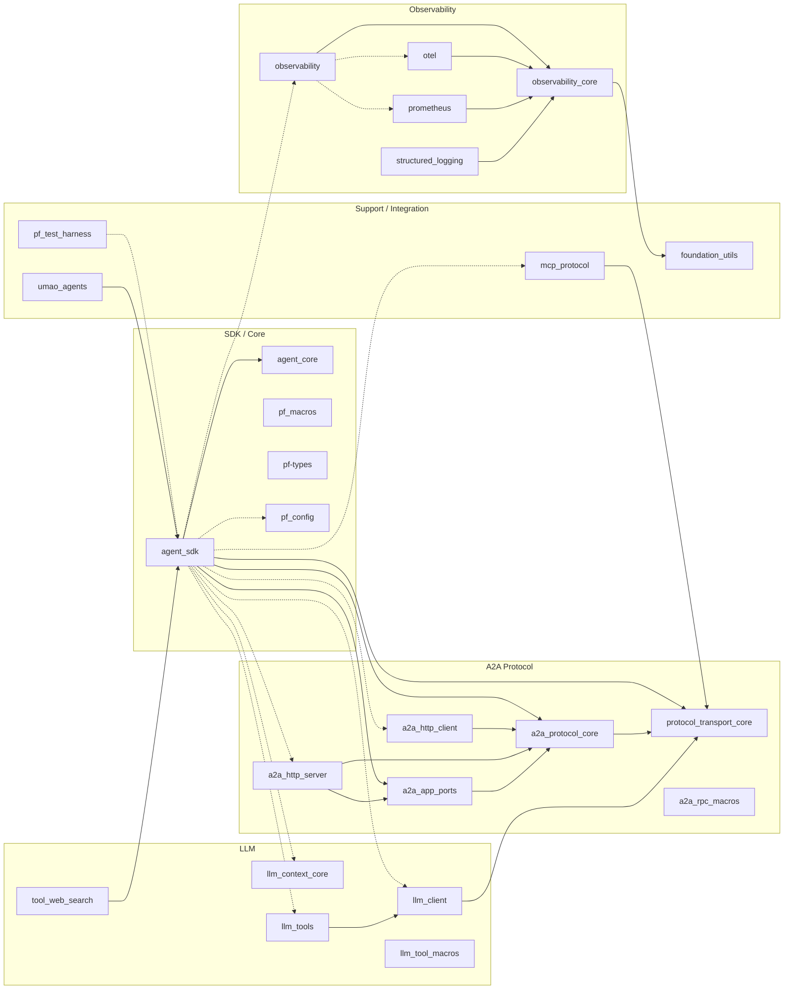

import { Aside } from '@astrojs/starlight/components';

The `promptfleet-agents` workspace contains 25 Rust crates organized into five groups. At the center sits `agent_sdk`, a facade that re-exports and wires together the crates you need based on Cargo feature flags. The protocol layer (`protocol_transport_core`) is shared by A2A, MCP, and the LLM client, so each protocol speaks the same JSON-RPC 2.0 dialect. Observability and utilities form the foundation layer with zero coupling to any protocol.

<Aside type="tip">
Solid arrows below are **required** dependencies. Dashed arrows are **optional** (feature-gated). The diagram is generated from the actual `[dependencies]` sections in each crate's `Cargo.toml`.
</Aside>

## Dependency diagram

## Crate reference

### SDK / Core

| Crate | Path | Role |
|-------|------|------|
| `agent_sdk` | `crates/agent_sdk` | Runtime-first SDK facade with optional A2A, AG-UI, LLM, and observability adapters |
| `agent_core` | `crates/agent_core` | Protocol-agnostic agent domain types — messages, tasks, artifacts, conversation context |
| `pf_macros` | `crates/pf_macros` | Proc-macro: `#[pf_agent]` attribute for Spin / A2A wiring |
| `pf-types` | `crates/commons/pf-types` | Lightweight naming primitives (`AgentSlug`, `normalize_name`) |
| `pf_config` | `crates/config/pf_config` | Layered configuration loader (JSON, env, dotenv, optional Cargo.toml section) |

### A2A Protocol

| Crate | Path | Role |
|-------|------|------|
| `protocol_transport_core` | `crates/protocol_transport_core` | Universal transport foundation for multiple protocols, SpinKube optimized |
| `a2a_protocol_core` | `crates/a2a_protocol_core` | Pure A2A protocol domain logic — types, events, JSON-RPC, WASM optimized |
| `a2a_http_client` | `crates/a2a_http_client` | A2A HTTP client — WASM default, native testing support |
| `a2a_http_server` | `crates/a2a_http_server` | A2A HTTP server — routing, dispatch, SSE streaming |
| `a2a_app_ports` | `crates/a2a_app_ports` | Application-layer ports for A2A servers (clean architecture traits) |
| `a2a_rpc_macros` | `crates/a2a_rpc_macros` | Proc-macro for automatic A2A JSON-RPC command registration |

### LLM

| Crate | Path | Role |
|-------|------|------|
| `llm_client` | `crates/llm/llm_client` | Provider-agnostic LLM client built on `protocol_transport_core` |
| `llm_context_core` | `crates/llm_context_core` | WASM-compatible context window management — tokens, budgets, history, memory |
| `llm_tools` | `crates/llm_tools` | Lightweight WASM-safe tool registry and execution |
| `llm_tool_macros` | `crates/llm_tool_macros` | Attribute macro to register Rust functions as LLM tools with JSON Schema |
| `tool_web_search` | `crates/llm_tools/tool_web_search` | Reusable LLM tool: web search via Tavily API |

### Observability

| Crate | Path | Role |
|-------|------|------|
| `observability` | `crates/observability/observability` | Facade: single entrypoint, `Obs` / `ObservabilityConfig`, optional OTEL and Prometheus deps |
| `observability_core` | `crates/observability/observability_core` | Core traits, context, adapters, `ObservabilityManager` |
| `structured_logging` | `crates/observability/structured_logging` | Extensions on top of `observability_core` (convenience, optional performance/correlation) |
| `otel` | `crates/observability/otel` | OpenTelemetry helpers (OTLP, sampling, resource attributes) |
| `prometheus` | `crates/observability/prometheus` | Prometheus metrics (feature-gated federation, push gateway, etc.) |

### Support / Integration

| Crate | Path | Role |
|-------|------|------|
| `foundation_utils` | `crates/foundation_utils` | Foundation utilities for RAII patterns, resource management, scoped operations |
| `mcp_protocol` | `crates/mcp_protocol` | Model Context Protocol (MCP) implementation — JSON-RPC 2.0 compatible |
| `pf_test_harness` | `crates/pf_test_harness` | Native-only test harness for streaming, SSE, and A2A route testing |
| `umao_agents` | `crates/umao_agents` | UMAO coordination for A2A agents — `AsyncNodeExecutor` backed by `agent_sdk` |

All crates compile to `wasm32-wasi` except `pf_test_harness` (native-only, uses tokio/axum).
