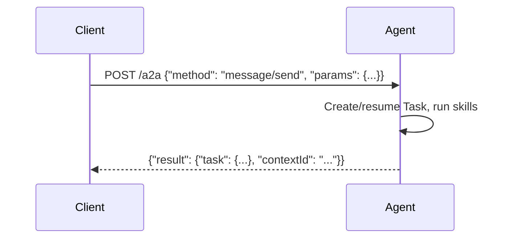
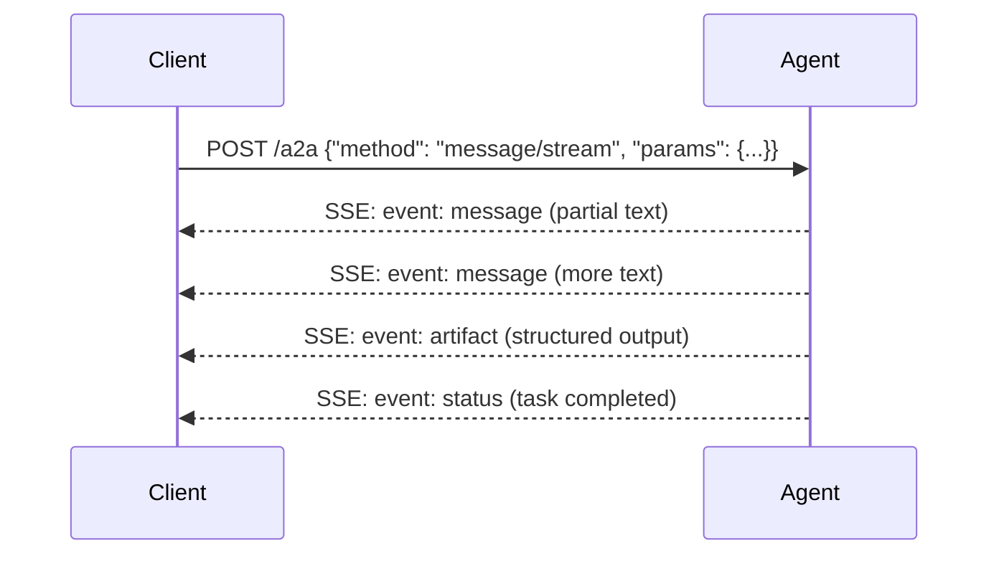
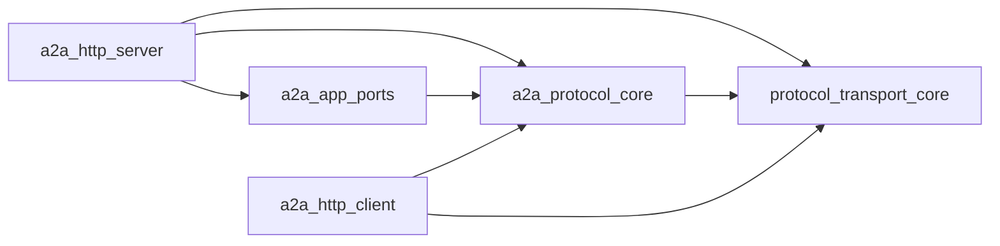

import { Aside } from '@astrojs/starlight/components';

## What is A2A?

[Agent-to-Agent (A2A)](https://google.github.io/A2A/) is Google's open protocol for interoperable agent communication. It defines how agents discover each other, exchange messages, manage long-running tasks, and stream partial results — all over plain HTTP using JSON-RPC 2.0.

PromptFleet implements A2A v1.0 across four crates, giving you the protocol for free when you enable the `a2a-server` or `a2a-client` features on `agent_sdk`.

## Key concepts

### Agent Cards

An Agent Card is a JSON document that describes what an agent can do. Clients fetch it via `GET /.well-known/agent.json` (or the JSON-RPC method `agent/authenticatedExtendedCard`) to discover an agent's skills, supported content types, and capabilities before sending any messages.

```json
{
  "name": "weather-agent",
  "description": "Provides weather forecasts",
  "url": "https://weather-agent.default.agentmesh",
  "version": "1.0.0",
  "capabilities": {
    "streaming": true,
    "pushNotifications": false
  },
  "skills": [
    {
      "id": "get_weather",
      "name": "get_weather",
      "description": "Returns current weather for a location"
    }
  ]
}
```

### Tasks

A Task is the unit of work in A2A. When a client sends a message, the server creates (or resumes) a Task that tracks state through a lifecycle:

```
submitted → working → completed
                   ↘ failed
                   ↘ canceled
```

Each Task has an ID, a history of Messages, optional Artifacts (structured output), and a status that the client can poll or stream.

### Messages

Messages carry the conversation between client and agent. Each Message has a `role` (`user` or `agent`) and a list of **Parts** — typed content blocks:

- **TextPart** — plain text or markdown
- **DataPart** — arbitrary JSON (structured tool output, metadata)
- **FilePart** — binary content (inline base64 or URI reference)

### JSON-RPC methods

A2A defines a small set of JSON-RPC 2.0 methods:

| Method | Direction | Purpose |
|--------|-----------|---------|
| `message/send` | Client → Agent | Send a message and get a synchronous response |
| `message/stream` | Client → Agent | Send a message and receive SSE streaming events |
| `tasks/get` | Client → Agent | Retrieve a task by ID |
| `tasks/cancel` | Client → Agent | Request cancellation of a running task |
| `tasks/list` | Client → Agent | List tasks (filtered by context or state) |

## Message flow

### Synchronous (request/response)



### Streaming (SSE)



<Aside type="note">
Streaming is available on native targets via the `event-stream` feature. On WASM, the agent responds synchronously — Spin handles one request at a time.
</Aside>

## Crate mapping

PromptFleet splits the A2A implementation into four focused crates, following clean architecture principles:

| Crate | Layer | What it does |
|-------|-------|--------------|
| [`protocol_transport_core`](/promptfleet-agents/a2a/protocol-transport-core/) | Transport | JSON-RPC 2.0 foundation — request/response/error types, request parsing, batch support. Shared by A2A, MCP, and LLM client. |
| [`a2a_protocol_core`](/promptfleet-agents/a2a/a2a-protocol-core/) | Domain | Pure A2A types — `AgentCard`, `Task`, `Message`, `Part`, `TaskStatus`, `A2AError`. Protocol handler and method registry. Zero transport dependency. |
| [`a2a_http_server`](/promptfleet-agents/a2a/a2a-http-server/) | Adapter (inbound) | HTTP dispatch: routes JSON-RPC requests to the protocol handler, serves Agent Cards, handles SSE streaming. Uses Spin SDK on WASM, Axum on native. |
| [`a2a_http_client`](/promptfleet-agents/a2a/a2a-http-client/) | Adapter (outbound) | HTTP client: sends JSON-RPC requests, parses responses, supports SSE streaming consumption. Uses Spin SDK on WASM, Reqwest on native. |
| [`a2a_app_ports`](/promptfleet-agents/a2a/a2a-app-ports/) | Ports | Clean-architecture traits (`MessageHandler`, `TaskStorage`) that decouple the server adapter from your application logic. |
| [`a2a_rpc_macros`](/promptfleet-agents/a2a/a2a-rpc-macros/) | Codegen | `#[a2a_rpc("method")]` proc-macro for registering custom JSON-RPC methods. |



<Aside type="tip">
When you enable `a2a-server` on `agent_sdk`, all of these crates are wired together automatically. You interact with them through `A2aApp::from_agent(agent)` — the crate boundaries are invisible to your agent code.
</Aside>

## Further reading

- [WASM vs Native](/promptfleet-agents/concepts/wasm-vs-native/) — how the A2A server adapts to each target
- [Architecture](/promptfleet-agents/architecture/) — full workspace dependency diagram
- [Google A2A specification](https://google.github.io/A2A/) — the upstream protocol spec
